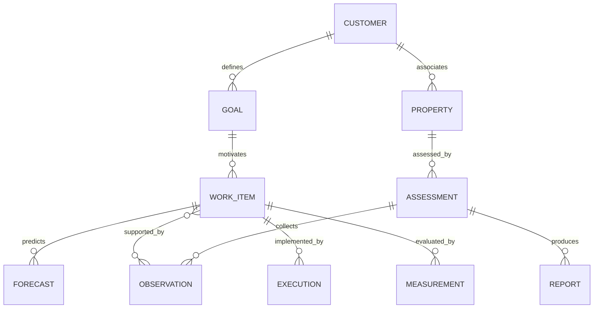

# Domain Model

Status: conceptual records derived from source requirements; physical schema, tenancy topology, cardinality details, and lifecycle enumerations remain proposals. Sources: H1–H5.

| Record | Responsibility and relationships |
| --- | --- |
| Customer / Business Profile | Business description, offerings, geographies, desired customers and optional budget; owns goals and properties |
| Business Goal | Ordinary-language objective and derived structured intent; referenced by assessments and work items |
| Web Property | Public domain/site associated with customer; ownership verification policy unresolved |
| Integration Connection | Authorized customer/provider/account binding and permission metadata; secret reference rather than raw credentials |
| Assessment | Dated run over specified property/goals; owns coverage and references observations, work items, report and baseline |
| Evidence / Observation | Captured fact, provenance, date and scope; reusable by multiple findings/work items |
| Search Intent / Keyword Candidate | Inferred topic/query family with geography and source/estimate distinction |
| Competitor Observation | Business/page visible for a specific observed query and context; not automatically a customer/vendor identity |
| Opportunity | Goal-related gap or opportunity that can produce one or more work items |
| Marketing Work Item | Canonical proposed action and benefit; references evidence, dependencies, forecast, approval requirement and results |
| Benefit Forecast / Measurement Plan | Versioned hypothesis and expected review window linked to work item |
| Baseline / Measurement | Starting and subsequent observations, including metric definitions and time windows |
| Report | Readable snapshot referencing assessment and work-item revisions |
| Approval / Standing Authorization | Specific action/version or bounded allowed class; separate from subscription entitlement |
| Execution / Verification | Attempt, target, before/after, outcome and follow-up evidence |
| Spend Policy | Customer/account/campaign/action limits; evaluation independent from model output |
| Subscription / Entitlement | Purchased capability access, separate from execution permission |
| Job / Audit Event | Operational attempt context and accountable event history |

## Proposed relationship sketch

This sketch illustrates references, not a final database schema or approved limits on shared goals and work items.

## Integrity rules

Enforce customer boundaries on records and links; an identifier alone is not access authority. Preserve the report's original evidence and recommendation versions. Later observations may update the plan without rewriting the historical baseline. Unknown estimates have explicit reasons, not artificial zeros. Provider/model IDs remain integration/job metadata rather than business entity types.

Physical isolation, membership roles, retention, and deletion are open decisions. See [architecture](system-architecture.md), [security](security-and-data-handling.md), and [work item](marketing-work-item.md).
