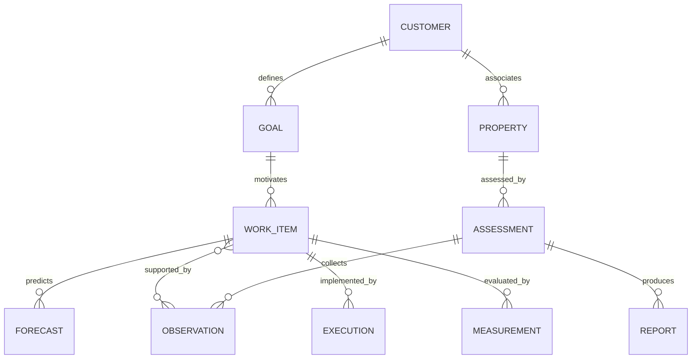

# Domain Model

Status: conceptual records derived from source requirements; physical schema, tenancy topology, cardinality details, and lifecycle enumerations remain proposals. Sources: H1–H5.

| Record | Responsibility and relationships |
| --- | --- |
| Customer / Business Profile | Business description, offerings, geographies, desired customers and optional budget; owns goals and properties |
| Business Goal | Ordinary-language objective and derived structured intent; referenced by assessments and work items |
| Web Property | Public domain/site associated with customer; ownership verification policy unresolved |
| Integration Connection | Authorized customer/provider/account binding and permission metadata; secret reference rather than raw credentials |
| Assessment | Dated run over specified property/goals; owns coverage and references observations, work items, report and baseline |
| Evidence / Observation | Captured fact, provenance, date and scope; reusable by multiple findings/work items |
| Search Intent / Keyword Candidate | Inferred topic/query family with geography and source/estimate distinction |
| Competitor Observation | Business/page visible for a specific observed query and context; not automatically a customer/vendor identity |
| Opportunity | Goal-related gap or opportunity that can produce one or more work items |
| Marketing Work Item | Canonical proposed action and benefit; references evidence, dependencies, forecast, approval requirement and results |
| Benefit Forecast / Measurement Plan | Versioned hypothesis and expected review window linked to work item |
| Baseline / Measurement | Starting and subsequent observations, including metric definitions and time windows |
| Report | Readable snapshot referencing assessment and work-item revisions |
| Approval / Standing Authorization | Specific action/version or bounded allowed class; separate from subscription entitlement |
| Execution / Verification | Attempt, target, before/after, outcome and follow-up evidence |
| Spend Policy | Customer/account/campaign/action limits; evaluation independent from model output |
| Subscription / Entitlement | Purchased capability access, separate from execution permission |
| Job / Audit Event | Operational attempt context and accountable event history |

## Proposed relationship sketch

This sketch illustrates references, not a final database schema or approved limits on shared goals and work items.

## Integrity rules

Enforce customer boundaries on records and links; an identifier alone is not access authority. Preserve the report's original evidence and recommendation versions. Later observations may update the plan without rewriting the historical baseline. Unknown estimates have explicit reasons, not artificial zeros. Provider/model IDs remain integration/job metadata rather than business entity types.

Physical isolation, membership roles, retention, and deletion are open decisions. See [architecture](system-architecture.md), [security](security-and-data-handling.md), and [work item](marketing-work-item.md).

## Expanded conceptual records

These logical records support the [expansion](agency-growth-expansion.md); physical schema is still an implementation proposal.

| Record | Links and ownership |
| --- | --- |
| Agency / Customer Membership | Authorized portfolio relationship; does not imply shared customer data access |
| Strategy Revision / Topic Cluster | References existing goals, candidates and target Web Properties/pages |
| Prompt Set / Visibility Observation | Versioned questions and sampled evidence using existing observation/measurement lineage |
| Brand Profile / Content Item / Content Revision | Customer instructions and reviewed artifacts linked to work items |
| Calendar Entry / Publication Target | Scheduled work and a scoped Integration Connection; Execution stores actual attempts |
| Expert Profile / Outreach Campaign / Pitch / Placement | Customer-authorized identity, recipients and outcomes linked to work/evidence |
| Branding Profile / Delivery Schedule / Delivery Record | Presentation and authorized distribution of canonical report revisions |
| Proposal Revision / Quote / Acceptance | Immutable commercial scope referencing assessment and work items |
| Onboarding Engagement / Payment Reference | Conversion and commercial status; reuse Customer, Property and Entitlement |

Prospect conversion updates lifecycle context without copying assessments into a second database. New records inherit customer isolation and history requirements. Cross-customer learning may not reuse private facts or artifacts without explicit permission.

## Managed-service backend records

Proposed logical extensions for [R-026 through R-034](managed-marketing-backend-expansion.md):

| Record | Canonical relationship |
| --- | --- |
| OfferingVersion / ServiceEngagement / DeliveryCycle | Versioned commercial scope and periods linked to Customer/Proposal/Entitlement |
| WorkAssignment / DeliverableRevision / FeedbackRevision | References Marketing Work Item and artifact revisions; no duplicate task authority |
| CostReservation / CostEntry / UsageEntry | Links policy, work/job, currency/period and verified cost source |
| CampaignPlan / ChannelConfiguration | Links goal, external account, creatives, approved allocation and measurement |
| SocialPublication / InboundConversation | Content execution and external thread references scoped to customer/account |
| ContactReference / ConsentEvent / Suppression / SegmentRevision | Minimal external identity and purpose/channel-specific sending controls |
| EmailCampaign / RecipientSend | Approved content/audience snapshot and per-recipient delivery history |
| InfluencerEngagement | Verified creator, contract scope, asset rights and authorized compensation |
| BusinessLocation / ListingBinding / ReviewObservation | Customer facts, provider binding and dated source evidence |
| WebsiteProject / ReleaseRecord / HostingRelationship | Scoped engineering work, deployment verification and provider responsibility |
| ProductReference / ListingRevision / FeedSubmission | Externally mastered catalog bindings and approved per-item changes |
| CreativeBrief / MediaAssetRevision | Source/derived media lineage, rights, reviews and usage |
| ConversionDefinition / TrackingPlan / MeasurementEvent / AttributionSnapshot | Versioned definitions and events attached to existing measurement/report model |
| CRMConnection / ExternalOutcomeReference | External lead/opportunity source ownership without a second CRM |

All references enforce customer compatibility. Shared agency access must be explicit; external IDs are unique within provider/account scope, not globally. Physical schemas and migration choices remain implementation proposals.
